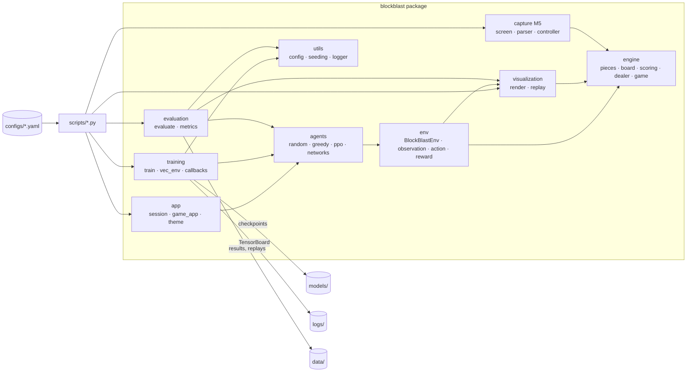
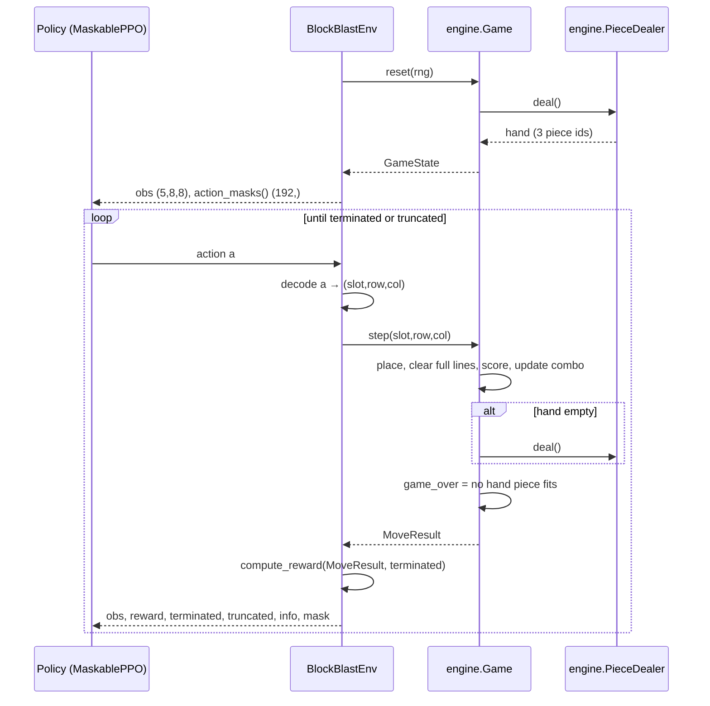

# ARCHITECTURE: Block Blast RL Agent

This is the full design. The binding invariants are summarized in `ARCHITECTURE-ESSENTIALS.md`. If the two documents ever disagree, fix the disagreement before writing code.

## 1. Stack

| Concern | Choice | Note |
|---|---|---|
| Language | Python 3.11 | Default |
| Dependencies | uv (`pyproject.toml`, `uv.lock`) | Default |
| Numerics | NumPy | Default |
| Env API | Gymnasium custom env | Default |
| RL | sb3-contrib `MaskablePPO` on PyTorch | Default. Masking removes the ~90 % of the 192 actions that are illegal in a typical state |
| Logging | TensorBoard via the SB3 logger, plus stdlib `logging` | Default |
| Config | Hydra (`hydra-core`, OmegaConf) | Picked over plain YAML for config groups (`agent=greedy`), CLI overrides and multirun sweeps |
| Tests | pytest + pytest-cov | pytest-cov **added** to enforce the 100 % engine-coverage gate |
| Lint/type | ruff, mypy | **Added**: cheap guardrails that keep code from several agents consistent |
| GIF export | imageio | **Added**: smallest dependency that writes GIFs from NumPy frames |
| Graphical game | pygame-ce | **Added**: windowed play, drag and drop, animations. Native Windows wheels. Only `blockblast.app` imports it |
| M5 extra (`[capture]`) | mss, opencv-python, pyautogui | **Added**, optional extra only, installed only for M5 |
| Compute | Local GTX 1650 (CUDA wheels via the `pytorch-cu126` uv index) or Google Colab GPU | PRD Q7. Rollout inference replays a CUDA graph (`torch.cuda.CUDAGraph`, part of PyTorch, no new dependency) |

## 2. System overview



### 2.1 Dependency direction (enforced)

```
engine  ←  visualization  ←  env  ←  agents  ←  {training, evaluation, app}  ←  scripts
engine  ←  capture
utils   ←  {training, evaluation, scripts}
```

| Package | May import from `blockblast.*` | Third-party allowed |
|---|---|---|
| `engine` | nothing | numpy, stdlib |
| `visualization` | `engine` | numpy, imageio |
| `env` | `engine`, `visualization` | gymnasium, numpy |
| `agents` | `env`, `engine` | torch, sb3-contrib, stable-baselines3, numpy |
| `training` | `agents`, `env`, `utils` | sb3-contrib, stable-baselines3, torch, hydra |
| `evaluation` | `agents`, `env`, `visualization`, `utils` | numpy |
| `utils` | nothing | stdlib, numpy, torch, omegaconf |
| `capture` | `engine` | mss, opencv-python, pyautogui |
| `app` | `agents`, `env`, `engine` | pygame-ce, numpy |

No import cycles. `engine` stays pure so it can be tested and optimized on its own.

## 3. Repository layout

Every path below exists. Directories with no files yet hold a `.gitkeep`.

```
.
├── CLAUDE.md                     # pointer to .claude/AGENTS.md + current project status
├── README.md                     # GitHub landing page: quick start, controls, how it works, results
├── pyproject.toml                # uv project, deps, ruff/mypy/pytest config
├── uv.lock                       # locked dependency versions (generated by uv)
├── .python-version               # 3.11 (uv python pin)
├── .gitignore                    # ignores .venv, logs/*, models/*, data/* (keeps .gitkeep), outputs/
├── .claude/
│   ├── PRD.md
│   ├── ARCHITECTURE.md
│   ├── ARCHITECTURE-ESSENTIALS.md
│   └── AGENTS.md
├── src/blockblast/
│   ├── __init__.py
│   ├── engine/        __init__.py pieces.py board.py scoring.py dealer.py game.py
│   ├── env/           __init__.py blockblast_env.py observation.py action.py reward.py
│   ├── agents/        __init__.py base.py random_agent.py greedy_agent.py networks.py ppo_agent.py
│   ├── training/      __init__.py train.py vec_env.py env_worker.py callbacks.py
│   ├── evaluation/    __init__.py evaluate.py metrics.py
│   ├── visualization/ __init__.py render.py replay.py
│   ├── utils/         __init__.py config.py seeding.py logger.py
│   ├── app/           __init__.py session.py game_app.py theme.py
│   └── capture/       __init__.py screen.py parser.py controller.py        (M5, deferred: empty until a platform is chosen)
├── configs/
│   ├── config.yaml                # Hydra root: defaults list, seed, run_name, paths
│   ├── env/default.yaml
│   ├── reward/default.yaml
│   ├── agent/{maskable_ppo,random,greedy}.yaml
│   ├── train/default.yaml
│   ├── eval/default.yaml
│   └── capture/default.yaml       (M5)
├── scripts/       train.py evaluate.py replay.py benchmark_env.py play.py play_real.py make_readme_assets.py
├── docs/images/   README images: gameplay.gif, screenshot_*.png, features.png, {results,training,observation,afterstate}_{light,dark}.png
├── tests/
│   ├── conftest.py
│   ├── engine/    test_pieces.py test_board.py test_scoring.py test_dealer.py test_game.py test_determinism.py
│   ├── env/       test_env_api.py test_observation.py test_action.py test_reward.py test_replay.py
│   ├── agents/    test_random_agent.py test_greedy_agent.py test_ppo_smoke.py test_afterstate.py test_pause_resume.py
│   ├── training/  test_vec_env.py
│   ├── evaluation/ test_metrics.py
│   └── app/       test_session.py test_game_app.py
├── notebooks/     train_colab.ipynb   # Colab GPU training; notebooks are never imported
├── models/                        # checkpoints: models/<run_name>/{best_model,final,ckpt_*}.zip + config.json
├── logs/                          # TensorBoard + Hydra run dirs: logs/<run_name>/
└── data/
    ├── replays/                   # EpisodeRecord JSON files
    ├── eval/                      # EvalResult JSON per (agent, tag)
    └── app/                       # best_human.json / best_ai.json written by the game
```

## 4. Module breakdown

| Module | File | Responsibility |
|---|---|---|
| Game engine | `engine/pieces.py` | Piece catalogue (immutable), precomputed placement bitmasks |
| | `engine/board.py` | Bitboard primitives: fit test, place, full-line detection, simultaneous clear, array conversion |
| | `engine/scoring.py` | `ScoreConfig`, score delta and combo-streak update |
| | `engine/dealer.py` | Draws 3-piece hands from an injected `np.random.Generator` |
| | `engine/game.py` | `GameState`, `MoveResult`, `Game` (reset, legality, step, round dealing, game over) |
| Gymnasium env | `env/blockblast_env.py` | `BlockBlastEnv`: Gymnasium API, `action_masks()`, render, info dict |
| Observation encoding | `env/observation.py` | `GameState` → `(5, 8, 8)` float32 tensor |
| Action space + masking | `env/action.py` | Encode/decode `(slot, row, col)` ↔ `0..191`, legal-action mask |
| Reward shaping | `env/reward.py` | `RewardConfig`, `compute_reward` for all reward modes |
| Agents / baselines | `agents/base.py` | `Agent` protocol |
| | `agents/random_agent.py` | Uniform over legal actions |
| | `agents/greedy_agent.py` | argmax immediate `Δscore` |
| | `agents/networks.py` | `BlockBlastCNN` extractor, `AfterstateExtractor` + `AfterstatePolicy` (default policy) |
| | `agents/ppo_agent.py` | Builds and loads MaskablePPO, wraps it as an `Agent` |
| Training loop | `training/train.py` | Hydra entry logic: build env and model, learn, checkpoint |
| | `training/vec_env.py` | Env factory, seeded vectorized envs (`ParallelVecEnv` or `DummyVecEnv`), config → env kwargs |
| | `training/env_worker.py` | Torch-free subprocess loop that steps a chunk of envs for `ParallelVecEnv` |
| | `training/callbacks.py` | Game-metric logging, periodic masked evaluation, checkpointing |
| Evaluation | `evaluation/evaluate.py` | Runs agents on fixed seeds, collects `EpisodeStats`, optional recording |
| | `evaluation/metrics.py` | Summary stats, bootstrap CI, agent comparison |
| Replay / visualization | `visualization/render.py` | ANSI and RGB rendering of a `GameState` |
| | `visualization/replay.py` | `EpisodeRecord` I/O, deterministic replay, GIF export |
| Config | `utils/config.py` + `configs/` | Structured config dataclasses; Hydra YAML is validated against them |
| Seeding | `utils/seeding.py` | Global seeding (python, numpy, torch), seed spawning |
| Logging | `utils/logger.py` | stdlib logging setup, run directory creation |
| Graphical game | `app/session.py` | Display-free session: moves, AI moves, per-cell colors, best score |
| | `app/game_app.py` | pygame window: drag and drop, placement ghost, line-clear preview and animation, popups, hint, AI autoplay |
| | `app/theme.py` | Layout constants and per-piece colors |
| Real-game input (M5) | `capture/screen.py` `parser.py` `controller.py` | Screen grab → `GameState`; action → mouse drag |
| Scripts | `scripts/train.py` | Hydra entry point → `training.train.train` |
| | `scripts/evaluate.py` | Hydra entry point → evaluation of the selected agent, writes `data/eval/` |
| | `scripts/replay.py` | Loads a record → ANSI playback or GIF |
| | `scripts/benchmark_env.py` | Measures env steps/s (PRD S4) |
| | `scripts/make_readme_assets.py` | Regenerates `docs/images/` (headless pygame screenshots + GIF, matplotlib charts). Run with `uv run --with matplotlib`; matplotlib is not a project dependency |
| | `scripts/play.py` | Launches the graphical game (`--watch`, `--agent`, `--checkpoint`, `--loop`, `--seed`, `--speed`) |
| | `scripts/play_real.py` | M5 loop: capture → parse → agent → controller |

## 5. Data flow



## 6. Game engine design

### 6.1 Piece catalogue v1

Pieces are fixed shapes. There is no rotation, so every orientation is a distinct catalogue entry. `piece_id` is the index in `PIECE_CATALOGUE`, and the order is frozen per `CATALOGUE_VERSION`. Offsets are measured from the top-left cell of the bounding box. The catalogue content was confirmed by the owner (PRD §8, Q1).

| ids | Shapes | Count |
|---|---|---|
| 0 | 1x1 | 1 |
| 1–8 | Lines of 2, 3, 4, 5 cells, horizontal and vertical | 8 |
| 9–10 | 2x2 square, 3x3 square | 2 |
| 11–14 | L tetromino, 4 orientations | 4 |
| 15–18 | J tetromino, 4 orientations | 4 |
| 19–22 | T tetromino, 4 orientations | 4 |
| 23–24 | S tetromino, 2 orientations | 2 |
| 25–26 | Z tetromino, 2 orientations | 2 |

Max bounding box is 5x5 and max cell count is 9 (the 3x3 square). Observation and action spaces do not depend on catalogue size, so changing the catalogue does not change the spaces.

### 6.2 Board representation

- The board is a Python `int` used as a 64-bit bitboard. Bit `r*8 + c` set means cell `(r, c)` is occupied.
- `PLACEMENT_MASKS[piece_id][r*8+c]` is precomputed at import. It is 0 when the piece would leave the board.
- `LINE_MASKS` holds 16 masks: rows 0–7 then columns 0–7.
- Legal placement: `mask != 0 and board & mask == 0`.
- Clearing: find every line with `board & L == L` **after** placement, then clear the union of those lines at once, so simultaneous row + column clears count correctly.

### 6.3 Rules as implemented

1. `reset`: empty board, `score = 0`, `combo_streak = 0`, `round_index = 1`, a 3-piece hand is dealt.
2. `step(slot, row, col)`: the slot must hold a piece and the placement must be legal, otherwise `InvalidMoveError`.
3. Place the piece → `n_cells`. Detect full lines → `n_lines`. Clear them simultaneously.
4. `Δscore = n_cells + 10 · n_lines · (1 + s)`, where `s` is the combo streak before the move. Then `s ← s + 1` if `n_lines ≥ 1`, otherwise `s ← 0`. Constants live in `ScoreConfig`.
5. Mark the slot used. If all 3 slots are used, deal a new hand and `round_index += 1`.
6. `game_over = True` if no remaining hand piece fits anywhere on the board.

### 6.4 Interfaces

```python
# engine/pieces.py
CATALOGUE_VERSION: Final[int]


@dataclass(frozen=True, slots=True)
class Piece:
    piece_id: int
    name: str
    cells: tuple[tuple[int, int], ...]  # (dr, dc) from bbox top-left
    height: int
    width: int

    @property
    def size(self) -> int: ...


PIECE_CATALOGUE: Final[tuple[Piece, ...]]
PLACEMENT_MASKS: Final[tuple[tuple[int, ...], ...]]  # [piece_id][row*8+col] -> bitmask | 0
VALID_PLACEMENTS: Final[
    tuple[tuple[tuple[int, int], ...], ...]
]  # [piece_id] -> ((row*8+col, mask), ...) in-bounds only


def get_piece(piece_id: int) -> Piece: ...
```

```python
# engine/board.py
BOARD_SIZE: Final[int]  # 8
FULL_BOARD: Final[int]  # 2**64 - 1
LINE_MASKS: Final[tuple[int, ...]]  # 16 masks: rows 0..7, cols 0..7


def can_place(board: int, mask: int) -> bool: ...
def place(board: int, mask: int) -> int: ...
def full_lines(board: int) -> tuple[int, ...]: ...  # indices into LINE_MASKS
def clear_lines(board: int, lines: Sequence[int]) -> int: ...
def popcount(board: int) -> int: ...
def to_array(board: int) -> npt.NDArray[np.uint8]: ...  # (8, 8)
def from_array(grid: npt.NDArray[np.integer]) -> int: ...
```

```python
# engine/scoring.py
@dataclass(frozen=True, slots=True)
class ScoreConfig:
    points_per_cell: int = 1
    points_per_line: int = 10


def score_move(n_cells: int, n_lines: int, combo_streak: int, cfg: ScoreConfig) -> int: ...
def next_combo_streak(n_lines: int, combo_streak: int) -> int: ...
```

```python
# engine/dealer.py
class PieceDealer:
    def __init__(self, rng: np.random.Generator, n_pieces: int = len(PIECE_CATALOGUE)) -> None: ...
    def deal(self) -> tuple[int, int, int]: ...
```

```python
# engine/game.py
HAND_SIZE: Final[int]  # 3
Hand = tuple[int | None, int | None, int | None]


@dataclass(frozen=True, slots=True)
class GameState:
    board: int
    hand: Hand  # piece_id per slot, None = used
    score: int
    combo_streak: int
    round_index: int  # hands dealt so far (1-based)
    moves: int
    game_over: bool


@dataclass(frozen=True, slots=True)
class MoveResult:
    state: GameState
    score_delta: int
    n_cells: int
    n_lines: int
    cleared_lines: tuple[int, ...]
    new_hand_dealt: bool


class InvalidMoveError(ValueError): ...


def legal_moves(state: GameState) -> npt.NDArray[np.bool_]: ...  # (3, 8, 8)
def apply_placement(
    state: GameState, slot: int, row: int, col: int, cfg: ScoreConfig
) -> MoveResult: ...  # pure, no dealing
def is_game_over(board: int, hand: tuple[int | None, ...]) -> bool: ...


class Game:
    def __init__(self, score_config: ScoreConfig = ScoreConfig()) -> None: ...
    @property
    def score_config(self) -> ScoreConfig: ...
    def reset(self, rng: np.random.Generator | int | None = None) -> GameState: ...
    @classmethod
    def from_state(
        cls, state: GameState, rng: np.random.Generator, score_config: ScoreConfig = ScoreConfig()
    ) -> "Game": ...
    @property
    def state(self) -> GameState: ...
    def legal_moves(self) -> npt.NDArray[np.bool_]: ...
    def is_legal(self, slot: int, row: int, col: int) -> bool: ...
    def step(self, slot: int, row: int, col: int) -> MoveResult: ...
```

## 7. Action space and masking

| Item | Definition |
|---|---|
| Space | `gymnasium.spaces.Discrete(192)` |
| Encoding | `a = slot·64 + row·8 + col`, with `slot ∈ {0,1,2}` and `row, col ∈ {0..7}` |
| Meaning | Place the piece in hand slot `slot` so that its bounding-box top-left cell lands on `(row, col)` |
| Mask | `(192,)` bool. `True` iff the slot holds a piece and `PLACEMENT_MASKS[piece][row*8+col] != 0` and there is no overlap. It equals `legal_moves(state).reshape(-1)` (C order) |
| Exposure | `BlockBlastEnv.action_masks()`, the method MaskablePPO discovers via `env_method` (`ParallelVecEnv` answers it from the masks returned with each step). `AfterstateExtractor.legal()` recomputes the same mask from the observation |
| Illegal action | `step` raises `InvalidMoveError`. It is never silently ignored |

```python
# env/action.py
N_SLOTS: Final[int]  # 3
N_ACTIONS: Final[int]  # 192


def encode_action(slot: int, row: int, col: int) -> int: ...
def decode_action(action: int) -> tuple[int, int, int]: ...
def action_mask(state: GameState) -> npt.NDArray[np.bool_]: ...  # (192,)
def action_space() -> gymnasium.spaces.Discrete: ...
```

## 8. Observation design

`Box(low=0.0, high=1.0, shape=(5, 8, 8), dtype=float32)`, channel-first:

| Channel | Content |
|---|---|
| 0 | Board occupancy (1 = filled) |
| 1, 2, 3 | Piece mask of hand slot 0, 1, 2, anchored at `(0, 0)` (bounding-box top-left). All zeros if the slot is used |
| 4 | Constant plane `min(combo_streak, 8) / 8` |

Reasons:
- One tensor with a single spatial frame lets a small CNN relate piece shapes to board holes directly.
- Anchoring pieces at `(0, 0)` matches the action definition (`row, col` = top-left of the bbox).
- An empty channel means the slot is used, so hand progress within a round needs no extra feature.
- Rejected: a `Dict` observation with a separate vector for the combo. It needs `MultiInputPolicy` and a custom combined extractor, and gives no gain at this size.

```python
# env/observation.py
OBS_SHAPE: Final[tuple[int, int, int]]  # (5, 8, 8)
COMBO_NORM: Final[int]  # 8


def observation_space() -> gymnasium.spaces.Box: ...
def piece_plane(piece_id: int) -> npt.NDArray[np.float32]: ...  # cached (8, 8)
def encode_observation(state: GameState) -> npt.NDArray[np.float32]: ...
```

## 9. Reward design

**Chosen default (`mode: score`):**

```
r_t = Δscore_t / 10 − 5 · 1[terminated_t]
Δscore_t = n_cells + 10 · n_lines · (1 + s)      # s = combo streak before the move
```

Truncation (`max_steps`) is not penalized. Evaluation always reports raw game score, never reward.

| Mode | Formula | Pros | Cons | Status |
|---|---|---|---|---|
| `score` | `Δscore/10 − 5·1[terminated]` | Aligned with the game objective. Dense. Every placement earns ≥ 1 point, so survival is implicitly rewarded | Combo spikes add variance | **Default** |
| `survival` | `+1` per move, `−5·1[terminated]` | Simple and low variance | Ignores clears and combos, so it undervalues score | Alternative |
| `sparse` | `final_score / 100` at termination, else 0 | No bias | Very hard credit assignment | Alternative (ablation) |
| Heuristic shaping (holes, bumpiness) | — | Faster early learning | Injects human bias and is hackable | Rejected |

```python
# env/reward.py
RewardMode = Literal["score", "survival", "sparse"]


@dataclass(frozen=True, slots=True)
class RewardConfig:
    mode: RewardMode = "score"
    score_scale: float = 10.0
    game_over_penalty: float = 5.0
    sparse_scale: float = 100.0


def compute_reward(result: MoveResult, terminated: bool, cfg: RewardConfig) -> float: ...
```

## 10. Environment

```python
# env/blockblast_env.py
class BlockBlastEnv(gymnasium.Env[npt.NDArray[np.float32], int]):
    metadata: ClassVar[dict[str, Any]]  # render_modes: ["ansi", "rgb_array"], render_fps: 4

    def __init__(
        self,
        reward_config: RewardConfig = RewardConfig(),
        score_config: ScoreConfig = ScoreConfig(),
        max_steps: int = 10_000,
        render_mode: str | None = None,
    ) -> None: ...
    def reset(
        self, *, seed: int | None = None, options: dict[str, Any] | None = None
    ) -> tuple[npt.NDArray[np.float32], dict[str, Any]]: ...
    def step(
        self, action: int
    ) -> tuple[npt.NDArray[np.float32], float, bool, bool, dict[str, Any]]: ...
    def action_masks(self) -> npt.NDArray[np.bool_]: ...
    def render(self) -> str | npt.NDArray[np.uint8] | None: ...
    @property
    def game(self) -> Game: ...
```

```python
# env/__init__.py registers:  gymnasium.register(id="BlockBlast-v0", entry_point=...)
```

- `terminated` = `GameState.game_over`. `truncated` = `moves >= max_steps`.
- `info` keys: `score`, `score_delta`, `round`, `moves`, `n_lines`, `combo_streak`, `lines_total`, `max_combo`. The mask is not in `info` (it would be copied and pickled on every step); read it with `action_masks()`.
- The mask is computed once per step and cached. `action_masks()` returns a copy.

## 11. Agents and baselines

```python
# agents/base.py
class Agent(Protocol):
    name: str

    def reset(self, seed: int | None = None) -> None: ...
    def act(
        self, obs: npt.NDArray[np.float32], action_mask: npt.NDArray[np.bool_], state: GameState
    ) -> int: ...


# agents/random_agent.py
class RandomAgent:
    def __init__(self, seed: int | None = None) -> None: ...
    def reset(self, seed: int | None = None) -> None: ...
    def act(self, obs, action_mask, state) -> int: ...


# agents/greedy_agent.py
class GreedyAgent:  # argmax apply_placement(...).score_delta, ties → lowest index
    def __init__(self, score_config: ScoreConfig = ScoreConfig()) -> None: ...
    @property
    def score_config(self) -> ScoreConfig: ...
    def reset(self, seed: int | None = None) -> None: ...
    def act(self, obs, action_mask, state) -> int: ...


# agents/networks.py
class BlockBlastCNN(
    BaseFeaturesExtractor
):  # 3× Conv3x3(64, pad=1)+ReLU → flatten → Linear(features_dim)
    def __init__(
        self, observation_space: gymnasium.spaces.Box, features_dim: int = 256
    ) -> None: ...
    def forward(self, observations: torch.Tensor) -> torch.Tensor: ...


# agents/ppo_agent.py
def linear_schedule(initial: float) -> Callable[[float], float]: ...
def build_model(
    env: VecEnv,
    ppo_kwargs: Mapping[str, Any],
    features_dim: int = 256,
    tensorboard_log: Path | None = None,
    seed: int = 0,
    device: str = "auto",
) -> MaskablePPO:
    ...
    # ppo_kwargs = the `agent.ppo` config mapping; agents never import utils


class PPOAgent:
    name: str

    def __init__(
        self, model: MaskablePPO, deterministic: bool = True, name: str = "ppo"
    ) -> None: ...
    @classmethod
    def load(cls, path: Path, device: str = "auto", deterministic: bool = True) -> "PPOAgent": ...
    def reset(self, seed: int | None = None) -> None: ...
    def act(self, obs, action_mask, state) -> int: ...
```

### 11.1 Afterstate policy (default, run `ppo_v2`)

Run `ppo_v1` used the plain CNN policy. It plateaued at a mean score of 164, which is 0.55× greedy, and its entropy collapsed by 6M steps. It had to learn the effect of each of the 192 placements from pixels. `AfterstatePolicy` removes that burden while keeping the observation, action space and reward unchanged:

1. From the `(5, 8, 8)` observation, a fixed 0/1 shift matrix places each slot's piece plane at all 64 positions, giving `(b, 192, 64)`.
2. The board after placement is computed exactly, and full rows and columns are cleared simultaneously. `n_lines`, `Δscore/10` and the new combo come out of the same computation. `tests/agents/test_afterstate.py` checks all of this against the engine for every legal action.
3. A shared MLP scores `(board after clears, the 2 remaining hand planes, n_lines, new combo, Δscore)`. The logit is `MLP(...) + alpha · Δscore/10`, with `alpha` learnable and initialised to 1. The MLP output layer starts near 0, so the initial policy is a soft greedy.
4. The critic is `BlockBlastCNN` on the current observation followed by `net_arch["vf"]`.

```python
# agents/networks.py
class AfterstateExtractor(BaseFeaturesExtractor):  # features = [192 logits | value_dim]
    def __init__(
        self, observation_space: gymnasium.spaces.Box, hidden: int = 128, value_dim: int = 256
    ) -> None: ...
    def afterstates(
        self, obs: torch.Tensor
    ) -> tuple[torch.Tensor, torch.Tensor, torch.Tensor, torch.Tensor]: ...
    def legal(self, obs: torch.Tensor) -> torch.Tensor: ...  # (b, 192) bool, equals the env mask
    def action_logits(
        self, obs: torch.Tensor, compact: bool = True
    ) -> torch.Tensor: ...  # (b, 192)
    def forward(self, observations: torch.Tensor) -> torch.Tensor: ...


ILLEGAL_LOGIT: Final[float]  # -1e8, the value MaskableCategorical writes for masked actions


class AfterstatePolicy(MaskableActorCriticPolicy):
    use_cuda_graphs: bool  # True; False forces the eager rollout path

    def __init__(self, *args: Any, vf_arch: list[int] | None = None, **kwargs: Any) -> None: ...
    def logits_and_values(self, obs: torch.Tensor) -> tuple[torch.Tensor, torch.Tensor]: ...
    def forward(self, obs, deterministic=False, action_masks=None): ...  # same contract as the base
    def predict_values(self, obs: PyTorchObs) -> torch.Tensor: ...  # critic only
```

Performance, with the checkpoint format and the learned function unchanged:
- Illegal actions get `ILLEGAL_LOGIT` instead of an MLP score. The mask replaces them with the same value and zeroes their gradients, so the masked distribution and all parameter gradients are the same (`test_compact_logits_match_dense_scoring`). On the real `ppo_v2` checkpoint the legal logits are bitwise equal to the dense implementation.
- `compact=True` (training, evaluation) runs the MLP only on legal actions, about 19 % of the 192 in real games, gathered with one `nonzero` (a host sync). `legal()` counts overlaps and in-board cells with two small GEMMs.
- `compact=False` scores all 192 with static shapes. Under `no_grad` on CUDA, `logits_and_values` replays a CUDA graph of it, captured per batch size: a b=64 rollout step is ~140 kernels, and on Windows launching them costs more than running them. Legal logits match the eager path within 2e-5. The graph reads parameters by address, so in-place optimizer steps and `load_state_dict` are seen; a re-allocation (`.to(device)`) triggers a new capture (`test_cuda_graph_rollout_matches_eager`).

`build_model(..., policy="afterstate" | "cnn")` selects it. The config key is `agent.policy`.

Default PPO hyperparameters (`configs/agent/maskable_ppo.yaml` + `configs/train/default.yaml`): `n_envs=64`, `n_steps=256`, `batch_size=1024` (afterstate activations are `(legal rows ≈ 0.19 · batch · 192, 128)`, ~250 MB peak CUDA memory), `n_epochs=4`, `lr=3e-4` linear decay, `gamma=0.995`, `gae_lambda=0.95`, `clip_range=0.2`, `ent_coef=0.01`, `net_arch=dict(pi=[256,256], vf=[256,256])`.

## 12. Training loop

```python
# training/vec_env.py
def env_kwargs_from_config(cfg: EnvConfig, reward: RewardSection) -> dict[str, Any]: ...
def make_env_fn(
    env_kwargs: dict[str, Any], seed: int, rank: int
) -> Callable[[], gymnasium.Env]: ...
def make_vec_env(
    env_kwargs: dict[str, Any], n_envs: int, seed: int, use_subproc: bool = True, n_workers: int = 8
) -> VecEnv: ...  # ParallelVecEnv if use_subproc else DummyVecEnv, wrapped in VecMonitor


class ParallelVecEnv(VecEnv):  # n_envs games split into contiguous chunks over n_workers processes
    def __init__(self, env_kwargs: dict[str, Any], n_envs: int, n_workers: int) -> None: ...
    def workers_import_torch(self) -> list[bool]: ...  # diagnostics, must be all False

    # step/reset: one message per worker; the masks come back with the step and
    # env_method("action_masks") is answered from that cache (no extra round trip)


# training/env_worker.py (imports no torch/SB3: spawned workers stay ~36 MB)
def worker(
    remote: Connection, parent_remote: Connection, env_kwargs: dict[str, Any], n_envs: int
) -> None: ...


# training/callbacks.py
class GameMetricsCallback(BaseCallback):  # logs game/score, game/rounds, game/lines, game/max_combo
    def __init__(self, verbose: int = 0) -> None: ...
    def _on_step(self) -> bool: ...


class PauseFileCallback(BaseCallback):  # stops cleanly when models/<run>/PAUSE exists
    def __init__(self, pause_file: Path, check_every: int = 256) -> None: ...


def restore_eval_history(callback: MaskableEvalCallback, run_dir: Path) -> None: ...
def make_callbacks(
    cfg: AppConfig,
    env_kwargs: dict[str, Any],
    run_dir: Path,
    model_dir: Path,
    resumed: bool = False,
) -> tuple[CallbackList, PauseFileCallback]:
    ...
    # GameMetricsCallback + MaskableEvalCallback (validation seeds from 900_000,
    # saves models/<run>/best_model.zip) + CheckpointCallback (ckpt_<steps>_steps.zip)


# training/train.py
def latest_checkpoint(model_dir: Path) -> Path | None: ...
def train(cfg: AppConfig) -> Path: ...  # final.zip, or ckpt_<steps>_steps.zip when paused
```

Flow: `scripts/train.py` (Hydra) → `set_global_seeds` → `make_run_dir` → `make_vec_env` → `build_model` → `model.learn(total_timesteps, callbacks)` → save `models/<run_name>/final.zip` plus `config.json` next to it.

Pause and resume:
- A `PAUSE` file in `models/<run_name>/` (checked every 256 steps) or Ctrl+C stops training and saves `ckpt_<num_timesteps>_steps.zip`. A stale `PAUSE` file is deleted when a session starts.
- `train.resume=auto` (the latest checkpoint) or `train.resume=<zip>` loads the model with the new vec env and calls `learn(total - num_timesteps, reset_num_timesteps=False)`. The step count, the linear LR schedule (`progress = steps / total`) and the TensorBoard run stay continuous. `restore_eval_history` reloads `logs/<run>/evaluations.npz`, so `best_model.zip` is only replaced by a better model.
- Env episodes in flight are not saved; resumed envs start new games. Hydra writes the resolved config to `logs/<run_name>/hydra/.hydra/`.

## 13. Evaluation

```python
# evaluation/evaluate.py
@dataclass(frozen=True, slots=True)
class EpisodeStats:
    seed: int
    score: int
    rounds: int
    moves: int
    lines_cleared: int
    max_combo: int
    truncated: bool = False


@dataclass(frozen=True, slots=True)
class EvalResult:
    agent_name: str
    episodes: tuple[EpisodeStats, ...]

    def summary(self) -> dict[str, float]: ...
    def to_json(self, path: Path) -> None: ...
    @classmethod
    def from_json(cls, path: Path) -> "EvalResult": ...


def run_episode(
    agent: Agent, env: BlockBlastEnv, seed: int, record: bool = False
) -> tuple[EpisodeStats, EpisodeRecord | None]: ...
def evaluate_agent(
    agent: Agent,
    seeds: Sequence[int],
    env_kwargs: dict[str, Any],
    record_dir: Path | None = None,
    record_n: int = 0,
) -> EvalResult: ...


# evaluation/metrics.py
@dataclass(frozen=True, slots=True)
class ComparisonResult:
    metric: str
    mean_a: float
    mean_b: float
    ratio: float
    diff_ci: tuple[float, float]


def summarize(
    values: Sequence[float],
) -> dict[str, float]: ...  # mean, std, median, p10, p90, min, max
def bootstrap_ci(
    values: Sequence[float], n_resamples: int = 10_000, alpha: float = 0.05, seed: int = 0
) -> tuple[float, float]: ...
def compare(a: EvalResult, b: EvalResult, metric: str = "score") -> ComparisonResult: ...
```

Protocol: 1,000 episodes, seeds `1_000_000 … 1_000_999`, deterministic policy, results written to `data/eval/<agent>_<eval.tag>.json`. The first `eval.record_n` episodes are saved to `data/replays/<agent>_seed<seed>.json`. `eval.compare_to` prints ratio and difference CI against another result file.

## 14. Replay and visualization

A replay is `(seed, action list)`. The engine is deterministic, so this reconstructs the whole episode.

```python
# visualization/render.py
def render_ansi(state: GameState) -> str: ...
def render_rgb(state: GameState, cell_px: int = 32) -> npt.NDArray[np.uint8]: ...  # (H, W, 3)


# visualization/replay.py
@dataclass(frozen=True, slots=True)
class EpisodeRecord:
    seed: int
    actions: tuple[int, ...]
    final_score: int
    agent_name: str
    catalogue_version: int
    score_config: dict[str, int]


def save_record(record: EpisodeRecord, path: Path) -> None: ...
def load_record(path: Path) -> EpisodeRecord: ...
def replay_states(record: EpisodeRecord) -> Iterator[GameState]: ...
def export_gif(record: EpisodeRecord, path: Path, fps: int = 4, cell_px: int = 32) -> Path: ...
```

`replay_states` uses `engine.Game` directly, with the same seeding path as `BlockBlastEnv.reset(seed)`: `np.random.default_rng(seed)`.

## 15. Config

Hydra root `configs/config.yaml`:

```yaml
defaults: [env: default, reward: default, agent: maskable_ppo, train: default, eval: default, _self_]
seed: 0
run_name: ${agent.name}_${now:%Y%m%d_%H%M%S}
paths: {models: models, logs: logs, data: data}
```

| File | Keys |
|---|---|
| `env/default.yaml` | `max_steps`, `points_per_cell`, `points_per_line` |
| `reward/default.yaml` | `mode`, `score_scale`, `game_over_penalty`, `sparse_scale` |
| `agent/maskable_ppo.yaml` | `name`, PPO hyperparameters (§11), `features_dim` |
| `agent/random.yaml` | `name`, `seed` |
| `agent/greedy.yaml` | `name` |
| `train/default.yaml` | `total_timesteps`, `n_envs`, `use_subproc`, `n_workers`, `checkpoint_freq`, `eval_freq`, `n_eval_episodes`, `device`, `deterministic_torch`, `resume` |
| `eval/default.yaml` | `seed_start: 1_000_000`, `n_episodes: 1000`, `checkpoint`, `record_n`, `deterministic`, `tag`, `compare_to` |
| `capture/default.yaml` | `region`, `grid_origin`, `cell_px`, `hand_slots`, `drag_duration_s` (M5, not in the defaults list) |

```python
# utils/config.py
CONFIG_DIR: Path  # <repo>/configs


@dataclass
class EnvConfig: ...


@dataclass
class RewardSection: ...


@dataclass
class AgentConfig: ...  # name, seed, features_dim, ppo: dict[str, Any]


@dataclass
class TrainConfig: ...


@dataclass
class EvalConfig: ...


@dataclass
class PathsConfig: ...


@dataclass
class AppConfig: ...  # env, reward, agent, train, eval, seed, run_name, paths


def to_app_config(cfg: DictConfig) -> AppConfig: ...  # validates against the schema
def load_config(
    overrides: list[str] | None = None,
) -> AppConfig: ...  # Hydra compose (tests, notebooks)
```

## 16. Logging

```python
# utils/logger.py
def setup_logging(level: str = "INFO", log_file: Path | None = None) -> logging.Logger: ...
def make_run_dir(root: Path, run_name: str) -> Path: ...
```

- TensorBoard scalars: SB3 defaults (`rollout/*`, `train/*`) plus `game/score`, `game/rounds`, `game/lines`, `game/max_combo` and the validation `eval/mean_reward`.
- Every run directory contains the resolved `config.yaml`, the git commit hash when available, and the seed.
- Library code never calls `print`.

## 17. Determinism and seeding

```python
# utils/seeding.py
TRAIN_SEED_MAX: Final[int]  # 1_000_000, training base seeds are < this
EVAL_SEED_START: Final[int]  # 1_000_000
VALIDATION_SEED_START: Final[int]  # 900_000, in-training eval callback only


def set_global_seeds(
    seed: int, deterministic_torch: bool = False
) -> None: ...  # random, numpy, torch
def spawn_seeds(seed: int, n: int) -> list[int]: ...  # np.random.SeedSequence
```

| Rule | Detail |
|---|---|
| Single RNG source in engine | `PieceDealer` uses an injected `np.random.Generator` (PCG64). There is no global RNG, no time, and no hash-order dependency |
| Env seeding | `reset(seed=s)` → `super().reset(seed=s)` → `Game.reset(self.np_random)`. `reset()` without a seed continues the stream (Gymnasium semantics) |
| Vec envs | Env `i` gets `seed + i`. Training base seeds are `< 1_000_000`, the validation callback starts at `900_000`, and test eval seeds are `≥ 1_000_000` |
| Torch | `set_global_seeds` seeds torch. CPU runs are reproducible. GPU runs are not guaranteed bitwise identical, and this is documented in run metadata |
| Replay | `(seed, actions)` reproduces the episode exactly (PRD S11) |

## 18. Testing strategy

| Layer | File | What is tested |
|---|---|---|
| Fixtures | `tests/conftest.py` | Seeded RNGs, handcrafted boards, near-full board factory |
| Engine | `test_pieces.py` | Catalogue ids are unique and contiguous, shapes are connected, bbox is correct, placement masks match brute force |
| | `test_board.py` | Fit, place, row/column/cross clears, simultaneous multi-line clears, array round trip |
| | `test_scoring.py` | Formula table cases, combo increment and reset |
| | `test_dealer.py` | Same seed gives the same hands. Distribution chi-square within tolerance over 100k draws |
| | `test_game.py` | Illegal moves raise, round dealing after 3 placements, game-over detection, `apply_placement` purity |
| | `test_determinism.py` | 1,000 seeded games bitwise identical, including across a subprocess (PRD S2) |
| Env | `test_env_api.py` | `check_env`, reset/step contract, truncation, info keys |
| | `test_observation.py` | Shape/dtype/bounds, channel semantics, used-slot zero plane, combo plane |
| | `test_action.py` | Encode/decode bijection over 0..191, mask equals `legal_moves` (property test over random states) |
| | `test_reward.py` | Each mode, terminal penalty, no penalty on truncation |
| | `test_replay.py` | Record → replay reproduces final score and states (PRD S11) |
| Agents | `test_random_agent.py` | Only masked-legal actions, seed reproducible |
| | `test_greedy_agent.py` | Picks max-Δscore action on crafted boards, tie-break |
| | `test_ppo_smoke.py` | 2,048-step MaskablePPO run on 2 envs completes. Save/load/act works. Eval of a checkpoint is reproducible (PRD S12) |
| | `test_afterstate.py` | Afterstates and `legal()` match the engine for every legal action. Compact logits and gradients equal dense scoring. Overridden `forward`/`predict_values` equal the base class. CUDA-graph rollout equals eager (skipped without a GPU) |
| Training | `test_vec_env.py` | `ParallelVecEnv` steps identically to `DummyVecEnv` for the same seeds, masks match, workers stay torch-free |

Engine gate: 100 % line + branch coverage for `blockblast.engine` before any M3 work.

## 19. Performance

| Technique | Where |
|---|---|
| Bitboard (`int`) board with precomputed placement and line masks | `engine/pieces.py`, `engine/board.py` |
| Legal mask = 192 AND tests, with no array allocation per test | `engine/game.py`, `env/action.py` |
| Cached per-piece `(8, 8)` float32 planes; observation built with 5 array copies | `env/observation.py` |
| 64 envs stepped in 8 torch-free worker processes (`ParallelVecEnv`, ~36 MB each) by default. A stock `SubprocVecEnv` worker re-imports torch (~0.5 GB) on Windows and needs one extra IPC round trip per step for the masks, which stalled a 16-worker run on 12 GB RAM. Scripts that start workers import the training stack inside `main()`. 4 to 11 workers measure the same; `use_subproc=false` (`DummyVecEnv`) is ~15 % slower | `training/vec_env.py`, `training/env_worker.py` |
| `Distribution.set_default_validate_args(False)`: the per-sample argument checks force a GPU sync (+8 % steps/s) | `agents/ppo_agent.py` |
| Afterstate MLP on legal actions only, `legal()` via GEMMs, one `(3b, 64) @ (64, 4096)` GEMM for placements: train phase 4.0 s → 2.05 s per 16,384-step rollout | `agents/networks.py` |
| CUDA-graph replay of the b=64 rollout forward: collect phase 2.7 s → 1.7 s per rollout | `agents/networks.py` (`AfterstatePolicy.logits_and_values`) |
| Throughput gate ≥ 5,000 steps/s single process (measured: 16,040) | `scripts/benchmark_env.py` (PRD S4) |
| Measured training throughput, afterstate policy with default configs on the GTX 1650 (i5-10500H, nothing else running, 2026-09-22): before these changes 2,360 steps/s (collect 3.0 s + train 4.0 s per rollout, GPU 59 %); now 4,300–4,430 steps/s (collect 1.7 s + train 2.05 s, GPU ~55 %, main process ~0.9 core, workers ~0.1 core each, ~2.0 GB RAM total, 250 MB CUDA memory). The main Python thread (kernel launches and syncs) is now the limit, not the GPU. Older CNN-policy numbers: 16 in-process envs ≈ 1,900 steps/s, 64 ≈ 3,400 (CPU-only with 16 envs ≈ 575) | `scripts/train.py` |
| Tried and rejected (no gain within ±5 % noise): `cudnn.benchmark`, more or fewer env workers (4/6/8/11) | |
| Escalation if the gate fails: profile, then a batched NumPy engine behind the same `Game` interface | `engine/` only. Interfaces stay unchanged |

## 20. Extension path to the real game (M5)

Deferred: there is no target platform (PRD Q6). The `capture/` files and `scripts/play_real.py` stay empty until a platform is chosen. The interfaces below are the contract for that work.

```python
# capture/screen.py
class ScreenGrabber:
    def __init__(self, region: tuple[int, int, int, int]) -> None: ...
    def grab(self) -> npt.NDArray[np.uint8]: ...  # (H, W, 3) BGR


# capture/parser.py
class ParseError(RuntimeError): ...


def parse_board(frame: npt.NDArray[np.uint8], cfg: CaptureConfig) -> int: ...
def parse_hand(
    frame: npt.NDArray[np.uint8], cfg: CaptureConfig
) -> tuple[int | None, int | None, int | None]: ...
def parse_state(
    frame: npt.NDArray[np.uint8], cfg: CaptureConfig, combo_streak: int
) -> GameState: ...


# capture/controller.py
class InputController:
    def __init__(self, cfg: CaptureConfig) -> None: ...
    def perform(self, slot: int, row: int, col: int) -> None: ...  # mouse drag slot → cell
```

- `parse_state` produces a normal `GameState`. `env.observation.encode_observation` and `env.action.action_mask` then apply unchanged, so the trained policy needs no modification.
- The combo streak and score are tracked locally from observed clears, because they are not parsed from pixels.
- Hand shapes are matched against `PIECE_CATALOGUE`. An unknown shape raises `ParseError`, which is how catalogue gaps (PRD Q1) are detected.
- `scripts/play_real.py`: grab → parse → `PPOAgent.act` → `InputController.perform` → wait for the animation → repeat.
- Validation: labelled frames stored under `data/` (PRD M5 exit criteria).

## 21. Graphical game

```python
# app/session.py
class PlaySession:
    colors: npt.NDArray[np.int8]  # (8, 8) piece id per filled cell, -1 empty (cosmetic)
    best: int
    last: MoveResult | None

    def __init__(
        self,
        seed: int | None = None,
        score_config: ScoreConfig = ScoreConfig(),
        best_path: Path | None = None,
    ) -> None: ...
    @property
    def state(self) -> GameState: ...
    def reset(self, seed: int | None = None) -> GameState: ...
    def is_legal(self, slot: int, row: int, col: int) -> bool: ...
    def preview(self, slot: int, row: int, col: int) -> MoveResult | None: ...
    def place(self, slot: int, row: int, col: int) -> MoveResult: ...
    def agent_action(self, agent: Agent) -> tuple[int, int, int]: ...


# app/game_app.py
@dataclass
class AppOptions:
    autoplay: bool = False
    loop: bool = False
    seed: int | None = None
    agent_label: str = "AI"
    speed: int = 1  # index into AI_DELAYS_S


class BlockBlastApp:
    def __init__(self, session: PlaySession, agent: Agent | None, options: AppOptions) -> None: ...
    def run(self) -> None: ...
    def handle_event(self, event: pygame.event.Event) -> None: ...
    def update(self, now: int) -> None: ...  # ms clock; injectable for tests
    def draw(self) -> None: ...
    def apply_move(self, slot: int, row: int, col: int) -> None: ...
    def restart(self) -> None: ...
    def save_screenshot(self, path: Path) -> None: ...
```

| Input | Action |
|---|---|
| Drag a tray piece | Ghost snaps to the grid when legal. Lines that would clear glow. Releasing places the piece; releasing elsewhere cancels |
| `H` | AI hint: pulsing outlined ghost of the agent's move |
| `A` | Toggle AI autoplay (take over at any time) |
| `Space`, `+`/`-` | Pause, AI speed (5 levels) |
| `R`, click on game over | Restart. `Esc` quits |

- The engine stays the source of truth. `PlaySession.colors` only tracks which piece filled each cell, for rendering.
- Tests run headless with `SDL_VIDEODRIVER=dummy` (`tests/app/`).
- `scripts/play.py --agent auto` loads `models/ppo_v2/best_model.zip`, then falls back to `ppo_v1`, then to greedy.
