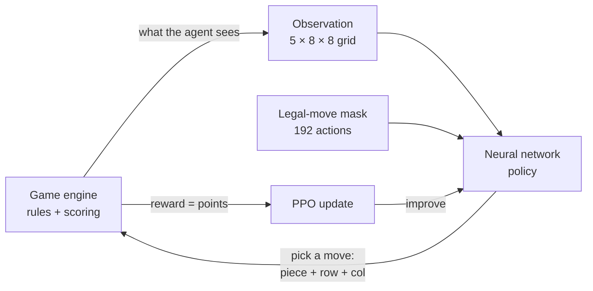

<div align="center">

# 🧩 Block Blast AI

**An AI that teaches itself to play Block Blast, plus a game you can play against it.**

[](https://www.python.org/)
[](https://pytorch.org/)
[](https://gymnasium.farama.org/)
[](https://sb3-contrib.readthedocs.io/)
[](#-running-the-tests)
[](https://docs.astral.sh/uv/)


*The trained agent (PPO v2) scoring **2,389 points** in a game it never saw during training.*

</div>

---

## Table of contents

- [What is this?](#-what-is-this)
- [The game in 30 seconds](#-the-game-in-30-seconds)
- [Quick start (5 minutes)](#-quick-start-5-minutes)
- [Playing the game](#-playing-the-game)
- [How the AI works](#-how-the-ai-works)
- [Results](#-results)
- [Train your own agent](#-train-your-own-agent)
- [Project structure](#-project-structure)
- [Running the tests](#-running-the-tests)
- [Troubleshooting](#-troubleshooting)
- [Next challenge: play forever](#-next-challenge-play-forever)
- [Roadmap](#-roadmap)

---

## 💡 What is this?

Block Blast is a puzzle game: you drop blocks onto an 8×8 grid and clear full rows and columns. This project contains:

1. **A faithful, deterministic game simulator**: the rules, written in pure Python and NumPy, with 100 % test coverage.
2. **An AI agent trained with reinforcement learning (RL)**. Nobody tells it how to play. It plays millions of games, gets points as a reward, and slowly figures out what works.
3. **A playable game window**: play yourself, ask the AI for a hint, or sit back and watch it play.

You don't need any machine-learning background to *play* with it. The [How the AI works](#-how-the-ai-works) section explains the ideas in plain words.

<p align="center">
  
  <br>
  <em>Left: drag a piece; lines it would complete light up. Middle: press <kbd>H</kbd> for an AI hint. Right: game over.</em>
</p>

## 🎮 The game in 30 seconds

| Rule | Details |
|---|---|
| Board | 8 × 8 grid, starts empty |
| Your hand | 3 pieces per round, drawn at random from 27 fixed shapes (lines, squares, L, J, T, S, Z). **No rotation** |
| A turn | Place one piece anywhere it fits. When all 3 are placed, you get 3 new ones |
| Clearing | Any full row **or** column disappears. Several can clear at once |
| Scoring | +1 per block placed, +10 per cleared line × (1 + combo). The combo grows with every move that clears something in a row |
| Game over | None of your remaining pieces fits anywhere |

## 🚀 Quick start (5 minutes)

**You need:** Windows, macOS or Linux, and [git](https://git-scm.com/downloads). Python is installed for you by `uv`.

**1. Install uv**, a fast Python package manager:

```bash
# macOS / Linux
curl -LsSf https://astral.sh/uv/install.sh | sh
```

```powershell
# Windows (PowerShell)
powershell -ExecutionPolicy ByPass -c "irm https://astral.sh/uv/install.ps1 | iex"
```

**2. Get the code and install everything.** This downloads Python 3.11, PyTorch and the rest into a local `.venv/`:

```bash
git clone https://github.com/<your-username>/block-blast-ai.git
cd block-blast-ai
uv sync
```

**3. Play!**

```bash
uv run python scripts/play.py
```

That's it. 🎉 Nothing to train first: without a trained model, the AI features use a simple greedy player.

> **No NVIDIA GPU?** Everything still works, including playing, evaluating and training; training is just slower.
> On Linux or Windows `uv sync` installs the CUDA build of PyTorch, which also runs on CPU.

## 🕹️ Playing the game

```bash
uv run python scripts/play.py                  # you play
uv run python scripts/play.py --watch --loop   # watch the AI play, game after game
```

| Control | What it does |
|---|---|
| **Drag** a piece from the tray | Move it over the board. A ghost shows where it will land, and lines it would complete glow |
| **Release** | Place it (releasing over an illegal spot sends it back) |
| <kbd>H</kbd> | **Hint**: the AI's suggested move pulses on the board |
| <kbd>A</kbd> | Let the **AI take over** (press again to take back control) |
| <kbd>Space</kbd> | Pause / resume the AI |
| <kbd>+</kbd> / <kbd>-</kbd> | AI speed (5 levels) |
| <kbd>R</kbd> or click on game over | New game |
| <kbd>Esc</kbd> | Quit |

Useful options: `--agent greedy|random|ppo`, `--checkpoint models/<run>/best_model.zip`, `--seed 42` (same pieces every time), `--speed 0..4`.
Best scores are saved separately for you and for the AI in `data/app/`.

## 🧠 How the AI works

### Reinforcement learning, in one paragraph

The agent looks at the game, picks a move, and receives a **reward**: the points that move earned, minus a penalty when the game ends. Early on its moves are random. After each batch of games, an algorithm called **PPO** (Proximal Policy Optimization) nudges its neural network toward the moves that led to more reward over the long run. After tens of millions of moves, it plays well. Invalid moves (overlapping blocks, falling off the board) are **masked out**, so the agent only ever picks among legal ones (**MaskablePPO**).



### What the agent sees

Every turn, the game is turned into five 8×8 grids: the board, one grid per piece in hand, and one grid holding the current combo streak.

<picture>
  <source media="(prefers-color-scheme: dark)" srcset="docs/images/observation_dark.png">
  
</picture>

A **move** is one of 3 × 8 × 8 = **192 actions**: *which piece* (3) × *which row* (8) × *which column* (8). Usually only a few dozen are legal.

### The trick that made it work: "afterstates"

Our first agent (**v1**) had to learn from raw pixels what each of the 192 moves would do to the board. It plateaued at about **half the score of a simple greedy player**.

The second agent (**v2**) is built differently. Inside the network, it computes the **exact board each move would produce**, including line clears, and then only has to judge *how good that resulting board is* (holes, space for the next pieces, combo potential). It starts out close to the greedy strategy, and training teaches it the long-term planning greedy lacks.

<picture>
  <source media="(prefers-color-scheme: dark)" srcset="docs/images/afterstate_dark.png">
  
</picture>

A test checks that these in-network boards match the real game engine exactly, for every legal move.

## 📊 Results

Every agent is scored on the **same 1,000 games** (fixed random seeds it never saw during training). We report the mean score with a 95 % confidence interval.

<picture>
  <source media="(prefers-color-scheme: dark)" srcset="docs/images/results_dark.png">
  
</picture>

| Agent | How it plays | Mean score | Rounds survived |
|---|---|---|---|
| Random | Any legal move | 60.8 | 4.6 |
| Greedy | The move with the most immediate points | 295.7 | 12.0 |
| PPO v1 | CNN policy, 50 M training moves | 164.0 | 8.2 |
| **PPO v2** | Afterstate policy, 40 M training moves | **1,299.4** | **40.4** |

PPO v2 scores **4.4× more than greedy** (95 % CI of the difference: +935 to +1,073 points) and **21× more than random**, and survives **3.4× as many rounds** as greedy. Half of its games score over 1,000, and its best game in this test scored **9,539**. It clears every success target in the [PRD](.claude/PRD.md).

**Training progress.** v1 stalls early. v2 passes the greedy baseline after about 1.5 M moves and is still climbing at 40 M:

<picture>
  <source media="(prefers-color-scheme: dark)" srcset="docs/images/training_dark.png">
  
</picture>

The project's success targets (mean score ≥ 1.5 × greedy, rounds ≥ 1.5 × greedy) are defined in [`.claude/PRD.md`](.claude/PRD.md).

## 🏋️ Train your own agent

```bash
uv run python scripts/train.py                                   # full run (defaults: 50M steps)
uv run python scripts/train.py train.total_timesteps=2000000     # quick 2M-step run (~15 min on a GPU)
uv run tensorboard --logdir logs                                 # live charts at http://localhost:6006
```

### ⏸️ Pause and resume

Training takes hours, but you don't have to finish in one go:

| To... | Do this |
|---|---|
| **Pause** (training in a terminal) | Press <kbd>Ctrl</kbd>+<kbd>C</kbd> |
| **Pause** (training in the background) | Create a file named `PAUSE` in the run's model folder. PowerShell: `New-Item models/<run>/PAUSE`. macOS/Linux: `touch models/<run>/PAUSE` |
| **Resume** | Run the **same command again** and add `train.resume=auto` |

```bash
uv run python scripts/train.py run_name=my_run train.resume=auto
```

When paused, the current model is saved as `models/<run>/ckpt_<steps>_steps.zip` at the exact step. Resuming loads the newest checkpoint and continues where it stopped: the step counter, the learning-rate schedule, the TensorBoard curve and the "best model so far" all carry on. If the computer crashes or loses power, nothing is saved at that moment, and you lose at most the last 2 M steps (~15 min), because a checkpoint is written every `train.checkpoint_freq` steps.

> Keep the same `run_name` and `train.total_timesteps` when you resume. `train.resume=path/to/ckpt.zip` resumes from a specific checkpoint.

Evaluate a checkpoint on the 1,000 held-out games and compare it with greedy:

```bash
uv run python scripts/evaluate.py agent=greedy
uv run python scripts/evaluate.py agent=maskable_ppo eval.checkpoint=models/<run>/best_model.zip eval.compare_to=data/eval/greedy_default.json
```

Replay a recorded game in the terminal or as a GIF:

```bash
uv run python scripts/replay.py data/replays/greedy_seed1000000.json --gif greedy.gif
```

| Where | Speed | Notes |
|---|---|---|
| Local NVIDIA GPU (GTX 1650) | ~4,300 steps/s (afterstate policy, defaults) | CUDA is picked automatically (`train.device=auto`) |
| CPU only | ~600 steps/s | Works; use fewer steps for experiments |
| Google Colab (free GPU) | similar to a local GPU | Open [`notebooks/train_colab.ipynb`](notebooks/train_colab.ipynb) |

All settings live in [`configs/`](configs/) ([Hydra](https://hydra.cc/)). Override anything from the command line, e.g. `agent.ppo.ent_coef=0.02` or `agent.policy=cnn`.

## 🗂️ Project structure

```
src/blockblast/
├── engine/         # the game rules: board, pieces, scoring, dealing (pure Python + NumPy)
├── env/            # Gymnasium environment: observation, 192 actions + mask, reward
├── agents/         # random, greedy, and the PPO agent (CNN and afterstate networks)
├── training/       # training loop, vectorized envs, TensorBoard callbacks
├── evaluation/     # fixed-seed evaluation, confidence intervals, comparisons
├── visualization/  # text/RGB rendering, replays, GIF export
├── app/            # the game window (pygame)
└── utils/          # config, seeding, logging
configs/            # Hydra YAML configs
scripts/            # play, train, evaluate, replay, benchmark, make_readme_assets
tests/              # 179 tests (engine, env, agents, training, evaluation, app)
notebooks/          # Colab training notebook
docs/images/        # README images (uv run --with matplotlib python scripts/make_readme_assets.py)
```

Design documents: [PRD](.claude/PRD.md) (goals and metrics), [architecture](.claude/ARCHITECTURE.md) (full design), [essentials](.claude/ARCHITECTURE-ESSENTIALS.md) (one-page invariants), [agent rules](.claude/AGENTS.md) (conventions for AI coding agents).

## ✅ Running the tests

```bash
uv run pytest                          # all 179 tests, about 40 s
uv run ruff check . && uv run mypy src # lint + strict type check
uv run python scripts/benchmark_env.py # simulator speed (≈16,000 steps/s)
```

The engine has **100 % line and branch coverage**, and 1,000 seeded games are checked to replay bit-for-bit identically, even in a separate process.

## 🛠️ Troubleshooting

<details>
<summary><b>The game window doesn't open / "No available video device"</b></summary>

You're probably on a machine without a display (SSH, WSL without GUI, a server). Run it on a desktop session. The tests use a hidden "dummy" display, so they still pass.
</details>

<details>
<summary><b>Training says <code>cpu</code> although I have an NVIDIA GPU</b></summary>

Check with `uv run python -c "import torch; print(torch.cuda.is_available())"`. If it prints `False`, update your NVIDIA driver. The project installs PyTorch built for CUDA 12.6.
</details>

<details>
<summary><b>Training uses lots of RAM or freezes on Windows with <code>train.use_subproc=true</code></b></summary>

The games run in 8 small worker processes (~36 MB each) that never import PyTorch. If the log warns `env workers imported torch`, a script imports the training stack at module level: on Windows each worker re-runs the script's top-level imports, so move those imports inside `main()` (see `scripts/train.py`). `train.use_subproc=false` runs all games in the main process instead, about 15 % slower.
</details>

<details>
<summary><b>Out of GPU memory</b></summary>

Lower the batch size: `agent.ppo.batch_size=512`.
</details>

## ♾️ Next challenge: play forever

Today the agent loses eventually. A typical game lasts about 31 rounds (40 on average), and the best ones score over 9,000 points. **The next challenge is to make it play (almost) infinitely**: keep the board clean enough that a game never ends.

**Why it's hard.** Pieces are random, so perfect play can't be guaranteed. Three 3×3 squares on a crowded board can end any game. To survive forever, the agent has to keep the board so open that even the worst hand still fits. That means planning several rounds ahead rather than chasing points.

**How we'll measure it.** Games are capped at 10,000 moves. The new headline metric is the **share of games that reach the cap** (`truncated_frac` in the evaluation output, 0 % today), next to median game length.

**Ideas we plan to try:**

| Idea | Why it should help |
|---|---|
| Look ahead over the whole hand (all 6 orders × placements of the 3 pieces) | Avoids placing piece 1 somewhere that blocks pieces 2 and 3 |
| Reward survival, not just points (`reward.mode=survival`) and a longer horizon (`gamma=0.999`) | Makes "stay alive" the goal instead of "score now" |
| Worst-case hand check: penalize boards where a 3×3 or 1×5 no longer fits | Teaches the agent to keep space for the most awkward pieces |
| Train much longer, with curriculum on harder deals | Long games are rare early in training, so the agent sees few of them |

## 🗺️ Roadmap

- [x] Deterministic simulator with full test coverage
- [x] Gymnasium env, random and greedy baselines, evaluation harness
- [x] MaskablePPO training (v1 CNN, v2 afterstate policy)
- [x] Playable game window with hints and AI autoplay
- [x] Final v2 evaluation: 4.4× greedy on score, 3.4× on survival (targets 1.5×)
- [ ] **Next challenge: play forever** (see above)
- [ ] Play the real mobile/web game through screen capture (optional)

---

<sub>A fan-made research project. Not affiliated with or endorsed by the makers of the original Block Blast game.</sub>
