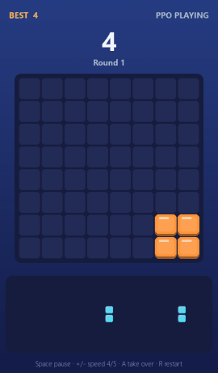
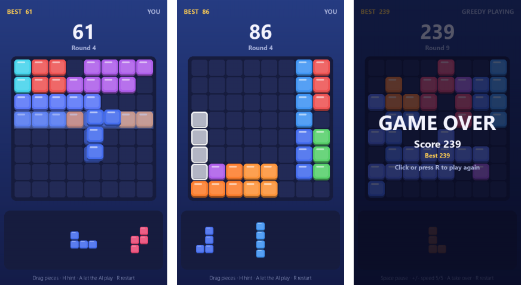
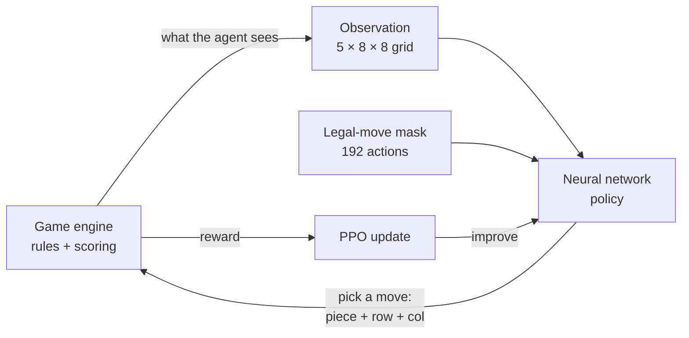
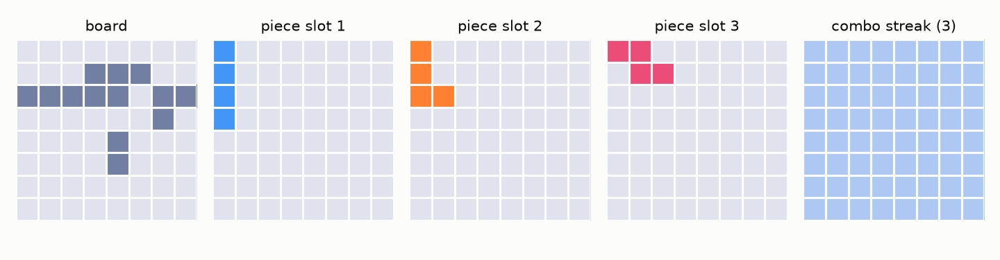
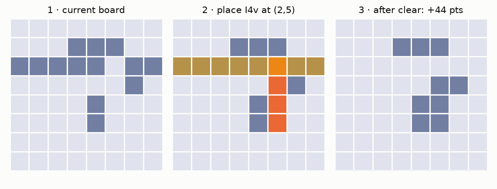
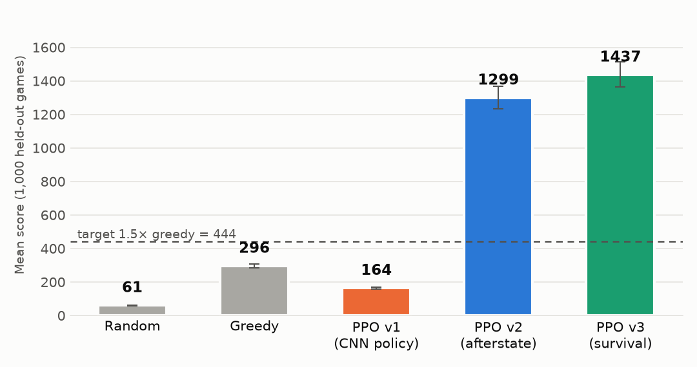
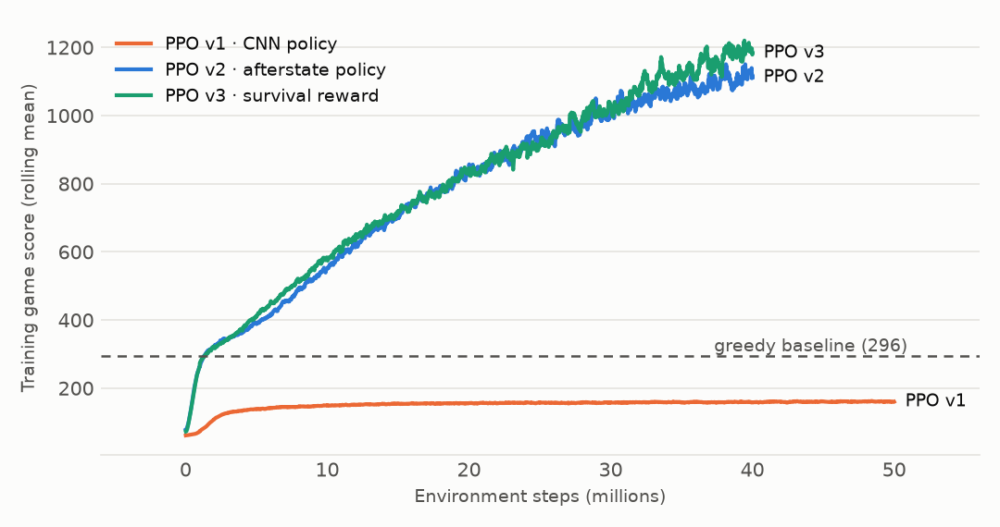

<div align="center">

# Block Blast AI

**An AI that taught itself to play Block Blast, plus a game you can play against it.**

[](https://www.python.org/)
[](https://pytorch.org/)
[](https://gymnasium.farama.org/)
[](https://sb3-contrib.readthedocs.io/)
[](#running-the-tests)
[](https://docs.astral.sh/uv/)



*The current agent scoring 2,258 points in a game it never saw during training.*

</div>

## Contents

- [What is this?](#what-is-this)
- [The game in 30 seconds](#the-game-in-30-seconds)
- [Quick start](#quick-start)
- [Playing the game](#playing-the-game)
- [How the AI works](#how-the-ai-works)
- [Results](#results)
- [Train your own agent](#train-your-own-agent)
- [Project structure](#project-structure)
- [Running the tests](#running-the-tests)
- [Troubleshooting](#troubleshooting)
- [What I want to do next](#what-i-want-to-do-next)

## What is this?

Block Blast is a puzzle game where you drop blocks onto an 8x8 grid and clear full rows and columns. This repo has three parts:

1. A game simulator written in Python and NumPy. Same rules, fully deterministic, covered by tests.
2. An agent trained with reinforcement learning. Nobody tells it how to play. It plays tens of millions of games and works out what keeps it alive.
3. A game window you can play in, with the option to ask the AI for a hint or let it take over.

You don't need any machine-learning background to play with it. [How the AI works](#how-the-ai-works) explains the ideas in plain words.

<p align="center">
  
  <br>
  <em>Left: drag a piece, and the lines it would complete light up. Middle: press H for a hint. Right: game over.</em>
</p>

## The game in 30 seconds

| Rule | Details |
|---|---|
| Board | 8x8 grid, starts empty |
| Your hand | 3 pieces per round, drawn at random from 27 fixed shapes (lines, squares, L, J, T, S, Z). No rotation |
| A turn | Place one piece anywhere it fits. When all 3 are placed you get 3 new ones |
| Clearing | Any full row or column disappears, and several can clear at once |
| Scoring | +1 per block placed, +10 per cleared line x (1 + combo). The combo grows with every move that clears something in a row |
| Game over | None of your remaining pieces fits anywhere |

## Quick start

You need Windows, macOS or Linux, and [git](https://git-scm.com/downloads). Python gets installed for you by `uv`.

Install uv, a fast Python package manager:

```bash
# macOS / Linux
curl -LsSf https://astral.sh/uv/install.sh | sh
```

```powershell
# Windows (PowerShell)
powershell -ExecutionPolicy ByPass -c "irm https://astral.sh/uv/install.ps1 | iex"
```

Get the code and install everything. This downloads Python 3.11, PyTorch and the rest into a local `.venv/`:

```bash
git clone https://github.com/Botkraker/block-blast-AI.git
cd block-blast-AI
uv sync
```

Then play:

```bash
uv run python scripts/play.py
```

That's it. There is nothing to train first: without a trained model the AI features fall back to a simple greedy player.

> No NVIDIA GPU? Everything still works, including playing, evaluating and training. Training is just slower. On Linux and Windows, `uv sync` installs the CUDA build of PyTorch, which also runs on CPU.

## Playing the game

```bash
uv run python scripts/play.py                  # you play
uv run python scripts/play.py --watch --loop   # watch the AI play, game after game
```

| Control | What it does |
|---|---|
| Drag a piece from the tray | Move it over the board. A ghost shows where it lands, and lines it would complete glow |
| Release | Place it. Releasing over an illegal spot sends it back |
| <kbd>H</kbd> | Hint: the AI's suggested move pulses on the board |
| <kbd>A</kbd> | Let the AI take over, press again to take back control |
| <kbd>Space</kbd> | Pause or resume the AI |
| <kbd>+</kbd> / <kbd>-</kbd> | AI speed, 5 levels |
| <kbd>R</kbd> or click on game over | New game |
| <kbd>Esc</kbd> | Quit |

Useful options: `--agent greedy|random|ppo`, `--checkpoint models/<run>/final.zip`, `--seed 42` for the same pieces every time, `--speed 0..4`. Best scores are kept separately for you and for the AI in `data/app/`.

## How the AI works

The agent looks at the board, picks a move, and gets a reward. Early on its moves are random. After each batch of games, an algorithm called PPO (Proximal Policy Optimization) nudges its neural network toward the moves that paid off over the long run. Illegal moves (overlapping blocks, pieces falling off the board) are masked out, so it only ever chooses among legal ones. That variant is called MaskablePPO.

What counts as a reward is a choice, and it turned out to be the most interesting one in this project. The first agents were paid in game points. The current one is paid for [staying alive with an empty board](#teaching-it-to-survive-instead-of-score) and ignores points entirely.



### What the agent sees

Every turn the game becomes five 8x8 grids: the board, one grid per piece in hand, and one holding the current combo streak.

<picture>
  <source media="(prefers-color-scheme: dark)" srcset="docs/images/observation_dark.png">
  
</picture>

A move is one of 3 x 8 x 8 = 192 actions: which piece, which row, which column. Usually only a few dozen are legal.

### The trick that made it work: afterstates

The first agent (v1) had to learn from the raw grids what each of the 192 moves would do to the board. It plateaued at about half the score of a simple greedy player.

The second agent (v2) works differently. Inside the network it computes the exact board each move would produce, line clears included, and then only has to judge how good that resulting board is: holes, space for the next pieces, combo potential. It starts out close to the greedy strategy, and training adds the planning greedy has no way to do.

<picture>
  <source media="(prefers-color-scheme: dark)" srcset="docs/images/afterstate_dark.png">
  
</picture>

A test checks these in-network boards against the real game engine for every legal move, so the shortcut can't quietly drift from the rules.

### Teaching it to survive instead of score

v2 chased points, which means it liked big combos even when they left the board crowded. The current agent (v3) never sees the game score during training. Its reward is:

```
reward per move = 1 - (filled cells / 64) - 20 if the game just ended
```

Every move it survives earns up to 1 point, reduced by how full the board is. A move that clears the board keeps the whole point, one that leaves it half full keeps 0.5, and losing costs 20. The bet was that an agent which keeps the board open lives longer and therefore scores more anyway, even without being paid for points. That is what happened: v3 both survives longer and scores higher than v2.

Three other changes came with it:

- It practises dangerous positions. Each training worker remembers crowded boards (24 or more filled cells) from its own earlier games, and a quarter of new training games start from one of them. Otherwise the agent rarely reaches those positions early in training, when it dies quickly.
- Its horizon is longer. `gamma=0.999` makes it weigh roughly 1,000 moves ahead, where v2 looked about 200 ahead. Survival pays off over hundreds of moves.
- Its built-in lean is stronger. Before learning anything, the network prefers the move leaving the fewest filled cells, minus a heavy penalty for any move after which a piece still in hand would fit nowhere.

## Results

Every agent plays the same 1,000 games, with fixed random seeds none of them saw during training. Scores come with a 95 % confidence interval.

<picture>
  <source media="(prefers-color-scheme: dark)" srcset="docs/images/results_dark.png">
  
</picture>

| Agent | How it plays | Mean score | Rounds survived |
|---|---|---|---|
| Random | Any legal move | 60.8 | 4.6 |
| Greedy | The move with the most immediate points | 295.7 | 12.0 |
| PPO v1 | CNN policy, 50 M training moves | 164.0 | 8.2 |
| PPO v2 | Afterstate policy paid in points, 40 M moves | 1,299.4 | 40.4 |
| **PPO v3** | **Afterstate policy paid for survival, 40 M moves** | **1,436.8** | **45.7** |

v3 scores 4.9x more than greedy and 24x more than random, and survives 3.8x as many rounds as greedy. Against v2 it scores 11 % higher (95 % CI of the difference: +36 to +237 points) and survives 13 % longer (+2.4 to +8.3 rounds), so neither gap is noise. Half its games pass 1,063 points and 35 rounds, its best game scored 8,661, and its longest lasted 260 rounds. It also clears more lines per game than v2, 62 against 54, because an open board clears lines more often than a crowded one does.

v2 still holds the single best game in the test at 9,539 points. It gambles on big combos, and once in a while the gamble pays.

**Training progress.** v1 stalls early. v2 and v3 pass the greedy baseline after about 1.5 M moves and were both still climbing at 40 M, where I stopped them:

<picture>
  <source media="(prefers-color-scheme: dark)" srcset="docs/images/training_dark.png">
  
</picture>

The goal I set at the start was 1.5x greedy on score and on rounds survived. v2 and v3 both clear it.

## Train your own agent

```bash
uv run python scripts/train.py                                   # defaults: 50M steps, points reward
uv run python scripts/train.py train.total_timesteps=2000000     # quick 2M-step run, ~15 min on a GPU
uv run tensorboard --logdir logs                                 # live charts at http://localhost:6006
```

To train the survival agent, the one in the results table:

```bash
uv run python scripts/train.py run_name=ppo_safe reward=safe train.total_timesteps=40000000 \
  agent.ppo.gamma=0.999 agent.prior=lookahead env.mid_start_prob=0.25
```

The four options behind it, all off by default, and none of them ever used during evaluation:

| Option | What it does |
|---|---|
| `reward=safe` | Pays for surviving with an empty board instead of for points ([details above](#teaching-it-to-survive-instead-of-score)) |
| `env.mid_start_prob=0.25` | Starts a quarter of training games from a crowded board the agent reached earlier |
| `agent.ppo.gamma=0.999` | Looks about 1,000 moves ahead instead of 200 |
| `agent.prior=lookahead` | Starting lean toward an empty board, penalising moves that strand a piece still in hand |

There is also `train.curriculum_steps=5000000`, which deals the hardest pieces (3x3 square, 1x5 lines) at a quarter of their normal rate early on and works up to the real game by that step. I built it but never used it for the runs above, since the schedule counts from step 0 and my run was already past it.

All settings live in [`configs/`](configs/), handled by [Hydra](https://hydra.cc/), and anything can be overridden on the command line, for example `agent.ppo.ent_coef=0.02` or `agent.policy=cnn`.

### Pause and resume

Training takes hours, and you don't have to finish in one go:

| To do this | Do that |
|---|---|
| Pause a run in a terminal | Press <kbd>Ctrl</kbd>+<kbd>C</kbd> |
| Pause a run in the background | Create a file named `PAUSE` in the run's model folder. PowerShell: `New-Item models/<run>/PAUSE`. macOS/Linux: `touch models/<run>/PAUSE` |
| Resume | Run the same command again with `train.resume=auto` added |

```bash
uv run python scripts/train.py run_name=my_run train.resume=auto
```

Pausing saves the model as `models/<run>/ckpt_<steps>_steps.zip` at the exact step. Resuming loads the newest checkpoint and carries on: step counter, learning-rate schedule, TensorBoard curve and the best model so far. A crash or a power cut saves nothing at that moment, so you lose at most the last `train.checkpoint_freq` steps, 2 M by default, about 15 minutes.

Keep the same `run_name` and `train.total_timesteps` when you resume, and repeat the options you started with. `gamma`, `agent.prior` and the environment options apply to a resumed run too, so leaving them out silently falls back to whatever the checkpoint holds. `train.resume=path/to/ckpt.zip` resumes from a specific file.

### Evaluating and replaying

Score a checkpoint on the 1,000 held-out games and compare it with another result:

```bash
uv run python scripts/evaluate.py agent=greedy
uv run python scripts/evaluate.py agent=maskable_ppo eval.checkpoint=models/<run>/final.zip eval.compare_to=data/eval/greedy_default.json
```

Replay a recorded game in the terminal or as a GIF:

```bash
uv run python scripts/replay.py data/replays/greedy_seed1000000.json --gif greedy.gif
```

### How fast it trains

| Where | Speed | Notes |
|---|---|---|
| Local NVIDIA GPU (GTX 1650) | ~4,300 steps/s, or ~3,500 with `agent.prior=lookahead` | CUDA is picked automatically (`train.device=auto`) |
| CPU only | ~600 steps/s | Works, but use fewer steps for experiments |
| Google Colab (free GPU) | similar to a local GPU | Open [`notebooks/train_colab.ipynb`](notebooks/train_colab.ipynb) |

40 M steps took about three hours on my GTX 1650. Most of the speed comes from running the games in worker processes that never import PyTorch, scoring only the legal moves, and replaying a captured CUDA graph during rollouts.

## Project structure

```
src/blockblast/
├── engine/         # the game rules: board, pieces, scoring, dealing (pure Python + NumPy)
├── env/            # Gymnasium environment: observation, 192 actions + mask, rewards
├── agents/         # random, greedy, and the PPO agent (CNN and afterstate networks)
├── training/       # training loop, parallel envs, curriculum and TensorBoard callbacks
├── evaluation/     # fixed-seed evaluation, confidence intervals, comparisons
├── visualization/  # text/RGB rendering, replays, GIF export
├── app/            # the game window (pygame)
└── utils/          # config, seeding, logging
configs/            # Hydra YAML configs
scripts/            # play, train, evaluate, replay, benchmark, make_readme_assets
tests/              # 190 tests (engine, env, agents, training, evaluation, app)
notebooks/          # Colab training notebook
docs/images/        # README images (uv run --with matplotlib python scripts/make_readme_assets.py)
```

## Running the tests

```bash
uv run pytest                          # 190 tests, about 40 s
uv run ruff check . && uv run mypy src # lint and strict type check
uv run python scripts/benchmark_env.py # simulator speed, around 16,000 steps/s
```

The engine has 100 % line and branch coverage, and 1,000 seeded games are checked to replay bit for bit, even in a separate process.

## Troubleshooting

<details>
<summary><b>The game window doesn't open, or says "No available video device"</b></summary>

You're probably on a machine without a display (SSH, WSL without a GUI, a server). Run it in a desktop session. The tests use a hidden dummy display, so they still pass.
</details>

<details>
<summary><b>Training says <code>cpu</code> although I have an NVIDIA GPU</b></summary>

Check with `uv run python -c "import torch; print(torch.cuda.is_available())"`. If it prints `False`, update your NVIDIA driver. The project installs PyTorch built for CUDA 12.6.
</details>

<details>
<summary><b>Training eats RAM or freezes on Windows with <code>train.use_subproc=true</code></b></summary>

The games run in 8 small worker processes (~36 MB each) that never import PyTorch. If the log warns `env workers imported torch`, some script imports the training stack at module level, and on Windows each worker re-runs those top-level imports. Move them inside `main()`, as `scripts/train.py` does. `train.use_subproc=false` runs every game in the main process instead, about 15 % slower.
</details>

<details>
<summary><b>Out of GPU memory</b></summary>

Lower the batch size: `agent.ppo.batch_size=512`.
</details>

## What I want to do next

The agent still loses eventually. A typical game lasts 35 rounds and the best ones pass 8,000 points, but no game has yet reached the 10,000-move cap that counts as playing forever. That's what I'm aiming at: keep the board open enough that the game never ends.

It's a hard target. Pieces come at random, so no strategy can guarantee survival, and three 3x3 squares on a crowded board end any game. Playing forever means keeping the board so open that even the worst possible hand still fits, which needs planning several rounds ahead rather than move by move.

The metric is the share of games that reach 10,000 moves, reported as `truncated_frac` by the evaluation script. It sits at 0 % for every agent so far. Ideas I haven't tried yet:

| Idea | Why it should help |
|---|---|
| Look ahead over the whole hand, all 6 orders of the 3 pieces | Stops the agent placing piece 1 somewhere that blocks pieces 2 and 3 |
| Penalise boards where a 3x3 or a 1x5 no longer fits anywhere | Teaches it to keep room for the most awkward pieces |
| Train much longer | Both curves were still rising at 40 M steps |
| Use the curriculum on a fresh run | Long games are rare early in training, so the agent sees few of them |

### Done so far

- [x] Deterministic simulator with full test coverage
- [x] Gymnasium environment, random and greedy baselines, evaluation harness
- [x] MaskablePPO training: v1 CNN policy, v2 afterstate policy
- [x] Playable game window with hints and AI autoplay
- [x] Faster training, from ~2,400 to ~4,300 steps/s on a GTX 1650, plus pause and resume
- [x] Survival reward, mid-game starts, longer horizon, lookahead lean (v3)
- [x] v3 evaluated: 4.9x greedy on score, 3.8x on rounds, and ahead of v2 on both
- [ ] Play forever: 0 % of games reach the 10,000-move cap
- [ ] Play the real mobile game through screen capture (optional)
